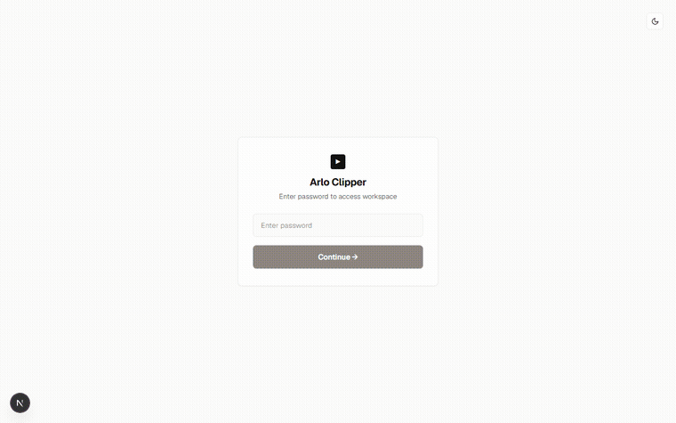
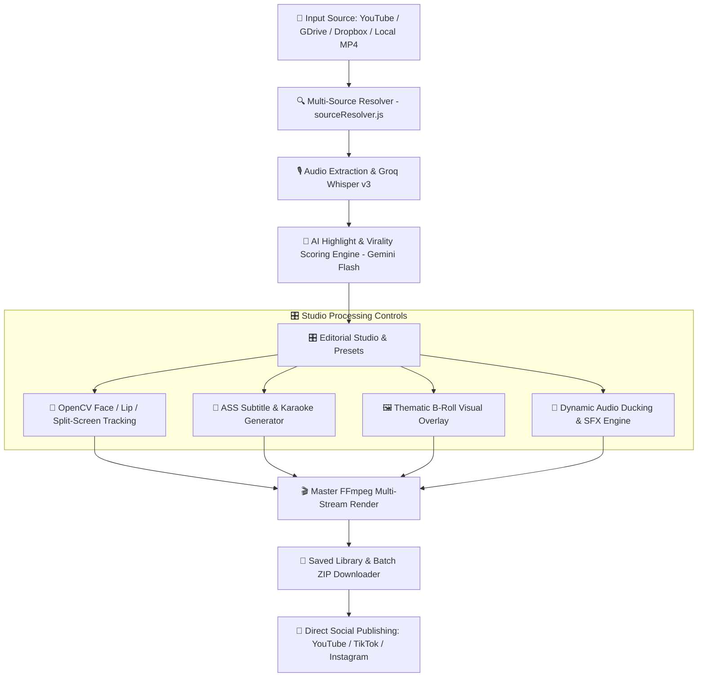

<div align="center">

# 🎬 Arlo Clipper

**Autonomous AI Video Clipper, Multi-Source Vertical Shorts Generator & Automated Social Publisher**  
*Pemotongan klip viral otomatis, transkripsi subtitle animasi Karaoke, auto-crop wajah OpenCV, audio ducking dinamis, dan publikasi otomatis ke YouTube Shorts, Instagram Reels, & TikTok.*

[](https://nextjs.org/)
[](https://react.dev/)
[](https://opencv.org/)
[](https://ffmpeg.org/)
[](https://groq.com/)
[](https://opensource.org/licenses/MIT)

[📘 **Baca Dokumentasi Arsitektur Lengkap (`docs/ARCHITECTURE.md`)**](docs/ARCHITECTURE.md)

</div>

---

## 🌟 Fitur Utama (Core Features)

| Fitur | Deskripsi |
| :--- | :--- |
| 🌐 **Multi-Source Video Input** | Mendukung input fleksibel dari **YouTube URL**, **Google Drive** (auto-bypass virus warning), **Dropbox** (`dl=1`), **TikTok**, **Direct Video Stream** (`.mp4`, `.mov`, `.mkv`), dan **Local File Upload**. |
| 🤖 **AI Highlight & Virality Scoring** | Menganalisis transkrip audio menggunakan **Google Gemini Flash** & **Groq LLM** dengan Virality Score (0–100) berbasis 3 pilar: *40% Hook Strength*, *30% Speech Pacing (135–170 WPM)*, dan *30% Emotional Retention*. |
| 👤 **OpenCV Smart Face & Lip Tracking** | Deteksi wajah & bibir pembicara aktif menggunakan Haar Cascade dengan perataan kamera *(Exponential Moving Average, $\alpha=0.08$)* untuk auto-crop vertikal 9:16 mulus tanpa getaran. |
| 🎙️ **Dual Podcast Split-Screen** | Mode otomatis podcast 2 pembicara: membagi frame horizontal menjadi layout vertikal 9:16 atas-bawah dengan garis pemisah (*divider*). |
| 🔤 **Dynamic Subtitle & Karaoke Engine** | Subtitle animasi modern (*Pop, Slide Up, Blur, Bounce*) serta word-level **Karaoke timing** (`\k` tags) yang dibakar permanen dengan FFmpeg `libass`. |
| 🎵 **Dynamic Audio Ducking & SFX** | Otomatis mengecilkan volume musik latar (BGM) saat vokal bicara terdengar menggunakan FFmpeg `sidechaincompress`, dilengkapi sound effect (*Impact, Pop, Ding, Whoosh*). |
| 🖼️ **Thematic B-Roll Overlays** | Deteksi kata kunci transkrip otomatis untuk memunculkan visual overlay kartu tematik (*Finance, Technology, Success, Alert, Nature, Celebration*). |
| 🚀 **Direct Social Media Publishing** | Upload 1-klik atau terjadwal langsung ke **YouTube Shorts** (Data API v3), **TikTok** (Content Posting API v2), dan **Instagram Reels** (Graph API) dengan proteksi anti-duplikasi. |
| ⚡ **Webhook Automation Pipeline** | Pipeline headless otomatis via HTTP POST dengan verifikasi tanda tangan **HMAC SHA-256**, retry backoff, dan pengiriman callback hasil klip. |
| ⏰ **Local Channel Watcher Bot** | Bot polling background yang memantau channel YouTube via RSS XML / yt-dlp, memotong video baru secara otomatis, mengekspor file MP4 + copy `.txt`, dan langsung menerbitkan ke medsos. |

---

## 🎥 Demonstrasi Visual (Live Demo)

### 🚀 Live End-to-End Workflow Automation
> *Demonstrasi lengkap: Login ➔ Input URL YouTube / Multi-source ➔ Analisis AI & Virality Score ➔ Editorial Studio (Custom Subtitle, B-Roll, Ducking, OpenCV Tracking) ➔ Save & Publish ke Medsos.*

<div align="center">
  
</div>

---

### 1. 🎯 OpenCV Smart Face Tracking (Auto-Crop 9:16)
> *Kamera vertikal 9:16 otomatis mengikuti pergerakan wajah pembicara secara halus tanpa getaran patah-patah.*

<div align="center">
  
</div>

---

### 2. 🔤 Dynamic Animated Subtitles & Karaoke
> *Subtitle bergaya modern dengan animasi Pop, Karaoke highlight, outline tebal, dan warna yang dapat diubah sesuai selera.*

<div align="center">
  
</div>

---

## 🔄 Alur & Arsitektur Proses (Workflow)



---

## 🛠️ Panduan Instalasi & Menjalankan (Getting Started)

### 1. Prasyarat Sistem
- **Node.js**: Versi `18.x` atau lebih baru (direkomendasikan Node 20+)
- **Python**: Versi `3.10+` (untuk modul pelacakan wajah OpenCV)
- **Git**

### 2. Clone Repository
```bash
git clone https://github.com/ArloDel/arlo-clipper.git
cd arlo-clipper
```

### 3. Install Dependensi Node.js & Python
```bash
# 1. Install Node modules
npm install

# 2. Install dependensi Python untuk OpenCV
pip install -r requirements.txt
```

### 4. Konfigurasi Environment Variables
Buat file `.env.local` di root proyek:
```env
# Groq API Key (Wajib untuk Transkripsi Whisper & LLM Cepat)
GROQ_API_KEY=gsk_your_groq_api_key_here

# Google Gemini API Key (Wajib untuk Analisis Viral Moment)
GEMINI_API_KEY=your_gemini_api_key_here

# Password Login Admin Aplikasi
ADMIN_PASSWORD=your_secure_password

# Secret Key untuk Webhook HMAC SHA-256 Signing
WEBHOOK_SECRET=arlo_clipper_secret_key_here

# Optional: Social Media OAuth Tokens (bisa diisi langsung di menu Publish UI)
YOUTUBE_CLIENT_ID=
YOUTUBE_CLIENT_SECRET=
YOUTUBE_REFRESH_TOKEN=
TIKTOK_ACCESS_TOKEN=
INSTAGRAM_ACCESS_TOKEN=
INSTAGRAM_ACCOUNT_ID=
```

### 5. Jalankan Development Server
```bash
npm run dev
```
Buka [http://localhost:3000](http://localhost:3000) di browser Anda.

---

## 🧪 Pengujian Otomatis (Automated Tests)

Repository ini dilengkapi dengan rangkaian test suite lengkap untuk memverifikasi setiap modul:

```bash
# Jalankan test subtitle Karaoke ASS
npm test

# Jalankan test virality scoring engine
npm run test:virality

# Jalankan test multi-source resolver (YouTube, GDrive, Dropbox, Direct MP4)
npm run test:multi-source

# Jalankan test audio ducking, SFX, dan B-Roll
npm run test:audio-broll

# Jalankan test webhook automation & HMAC signature
npm run test:webhook

# Jalankan test local channel watcher bot
npm run test:bot

# Jalankan test direct social media publishers
npm run test:publishers

# Jalankan test filter status dan library pagination
npm run test:filters
```

---

## 📁 Struktur Direktori (Project Structure)

```text
arlo-clipper/
├── app/                          # Next.js 16 App Router (UI & API Routes)
│   ├── api/                      # 25+ Endpoint API Modular
│   │   ├── analyze/              # AI Viral Moment detector
│   │   ├── bot/                  # Watcher Bot scheduler endpoints
│   │   ├── clips/                # CRUD, bulk delete, streaming zip
│   │   ├── face-track/           # OpenCV single face tracker
│   │   ├── lip-track/            # OpenCV active speaker lip tracker
│   │   ├── podcast-split/        # OpenCV dual podcast split screen
│   │   ├── prepare-editor/       # Slicing video & Whisper transcription
│   │   ├── publish/              # Multi-platform direct social publisher
│   │   ├── render-final/         # FFmpeg libass subtitle & audio ducking burner
│   │   ├── upload/               # Local file upload handler
│   │   └── webhook/              # Inbound/outbound webhook automation
│   ├── bot/                      # Halaman Dashboard Channel Watcher Bot
│   ├── editorial/                # Studio Editor (Subtitles, B-Roll, Audio Ducking)
│   ├── library/                  # Manajemen Pustaka Klip & Direct Publisher
│   └── login/                    # Autentikasi Admin
├── data/                         # Persistent Database JSON (Zero External DB)
│   ├── botConfig.json            # Konfigurasi bot & interval scheduler
│   ├── botHistory.json           # Log video yang telah diproses bot
│   ├── db.json                   # Database klip tersimpan
│   ├── publishHistory.json       # Log riwayat publikasi medsos
│   ├── socialTokens.json         # Kredensial & token OAuth tersimpan
│   └── webhooks.json             # Log aktivitas webhook inbound & outbound
├── docs/                         # Dokumentasi Arsitektur
│   ├── ARCHITECTURE.md           # Authoritative System Architecture & API Guide
│   └── assets/                   # Visual demo GIF
├── lib/                          # Modul Domain Core Engine (JSDoc Documented)
│   ├── audioAssets.js            # Generator WAV sintetis royalty-free (BGM & SFX)
│   ├── audioCatalog.js           # Katalog BGM, SFX & Ducking Presets
│   ├── audioDucking.js           # FFmpeg multi-stream complex filter builder
│   ├── broll.js                  # Generator kartu visual PNG/SVG mandiri
│   ├── brollCatalog.js           # Katalog tema B-Roll & keyword matcher
│   ├── db.js                     # CRUD database JSON & pagination
│   ├── localBot.js               # Channel watcher bot & background timer
│   ├── socialCopy.js             # Generator copy viral, hook, & hashtag
│   ├── socialPublishers.js       # Publisher langsung YouTube/TikTok/Instagram
│   ├── sourceResolver.js         # Multi-source input parser & normalizer
│   ├── sourceStreamer.js         # Stream downloader HTTP dengan redirect handling
│   ├── subtitles.js              # ASS subtitle generator dengan Karaoke timing
│   ├── viralityScore.js          # Engine Virality Score 0-100 (Hook, Pace, Emotion)
│   ├── webhookPipeline.js        # Pipeline video headless otomatis end-to-end
│   └── webhooks.js               # HMAC SHA-256 signer & webhook dispatcher
├── scripts/                      # Skrip Computer Vision Python & Test Suite
│   ├── haarcascade_*.xml         # Model Haar Cascade offline
│   ├── track_face.py             # OpenCV face tracking dengan perataan EMA
│   ├── track_lip.py              # OpenCV lip motion tracker
│   ├── track_split_screen.py     # OpenCV dual-speaker podcast split-screen
│   └── test_*.mjs / test_*.py    # Automated test scripts
├── package.json                  # Node.js manifest ("type": "module")
└── requirements.txt              # Dependensi Python (opencv-python, numpy)
```

---

## 📄 Lisensi
Didistribusikan di bawah lisensi MIT. Lihat `LICENSE` untuk informasi lebih lanjut.
