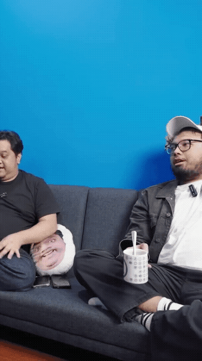
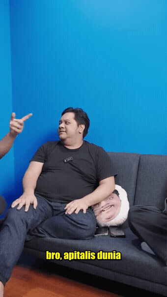
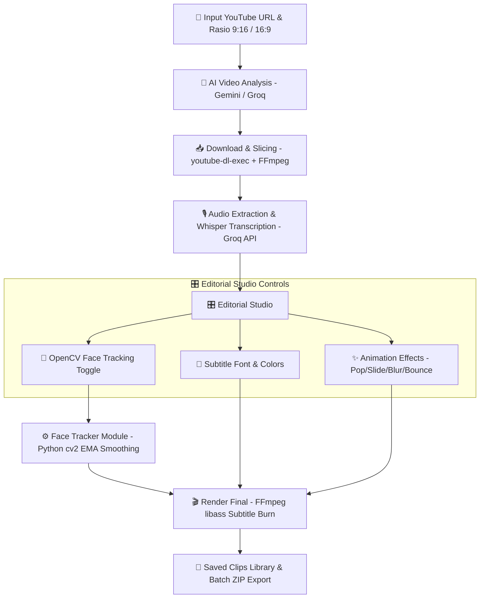

<div align="center">

# 🎬 Arlo Clipper

**AI-Powered YouTube Video Clipper & Vertical Shorts Generator**  
*Otomatisasi pemotongan klip viral, transkripsi subtitle animasi, dan smart auto-crop wajah berbasis OpenCV.*

[](https://nextjs.org/)
[](https://react.dev/)
[](https://opencv.org/)
[](https://ffmpeg.org/)
[](https://groq.com/)

</div>

---

## 🌟 Fitur Utama (Features)

| Fitur | Deskripsi |
| :--- | :--- |
| 🤖 **AI Highlight Detector** | Menganalisis video YouTube panjang menggunakan LLM (Google Gemini / Groq) untuk menemukan momen-momen paling menarik dan viral secara otomatis. |
| 👤 **OpenCV Smart Face Tracking** | Deteksi wajah (Haar Cascade) dengan perataan pergerakan kamera *(Exponential Moving Average)* untuk auto-crop vertikal 9:16 yang mulus berpusat pada pembicara. |
| 🎙️ **Groq Whisper Transcription** | Transkripsi audio otomatis berkecepatan tinggi dengan timestamp per-segmen menggunakan model `whisper-large-v3`. |
| 🎨 **Animated Subtitle Studio** | Kustomisasi subtitle interaktif di browser (Font, Ukuran, Warna teks, Outline, Drop shadow, serta efek animasi: *Pop, Slide Up, Blur, Bounce*). |
| ⚡ **Hard-Burn Subtitle Rendering** | Pembakaran subtitle permanen ke file MP4 menggunakan FFmpeg `libass` dengan penskalaan proporsional resolusi asli. |
| 📦 **Library & Bulk Downloader** | Manajemen pustaka klip tersimpan dengan opsi download satu per satu atau unduh massal dalam format `.zip`. |

---

## 🎥 Demonstrasi Visual (Live Demo)

### 1. 🎯 OpenCV Smart Face Tracking (Auto-Crop 9:16)
> *Kamera vertikal 9:16 otomatis mengikuti pergerakan wajah pembicara secara halus tanpa getaran patah-patah.*

<div align="center">
  
</div>

---

### 2. 🔤 Dynamic Animated Subtitles
> *Subtitle bergaya modern dengan animasi Pop, outline tebal, dan warna yang dapat diubah sesuai selera.*

<div align="center">
  
</div>

---

## 🔄 Alur & Arsitektur Proses (Workflow)



---

## 🛠️ Panduan Instalasi & Menjalankan (Getting Started)

### 1. Prasyarat Sistem
- **Node.js**: Versi `18.x` atau lebih baru (direkomendasikan Node 20+)
- **Python**: Versi `3.10+` (untuk modul pelacakan wajah OpenCV)
- **Git**

### 2. Clone Repository
```bash
git clone https://github.com/ArloDel/arlo-clipper.git
cd arlo-clipper
```

### 3. Install Dependensi Node.js & Python
```bash
# 1. Install Node modules
npm install

# 2. Install dependensi Python untuk OpenCV
pip install -r requirements.txt
```

### 4. Konfigurasi Environment Variables
Buat file `.env.local` di root proyek:
```env
# Groq API Key (Wajib untuk Transkripsi Whisper & Analisis Cepat)
GROQ_API_KEY=gsk_your_groq_api_key_here

# Google Gemini API Key (Untuk Analisis Viral Clip)
GEMINI_API_KEY=your_gemini_api_key_here

# Password Login Admin Aplikasi
ADMIN_PASSWORD=your_secure_password
```

### 5. Jalankan Development Server
```bash
npm run dev
```
Buka [http://localhost:3000](http://localhost:3000) di browser.

---

## 📖 Panduan Penggunaan (Step-by-Step Guide)

1. **Input Video**: Tempelkan URL video YouTube pada halaman utama dan pilih rasio target (Vertikal `9:16` untuk TikTok/Reels/Shorts atau Horizontal `16:9`).
2. **Analisis AI**: Klik tombol **Generate Clips**. Sistem akan mengekstrak transkrip, menganalisis bagian paling menarik, dan menyajikan daftar klip kandidat.
3. **Editor Studio**:
   - Aktifkan toggle **Face Tracking (OpenCV)** jika ingin kamera vertikal otomatis mengikuti wajah pembicara.
   - Atur jenis font (*Impact, Montserrat, Roboto, Bangers*), ukuran, warna, outline, serta animasi teks.
4. **Save & Export**: Klik **Save to Library**. Sistem akan membakar subtitle ASS secara permanen ke video dengan FFmpeg.
5. **Download**: Buka menu **Library** untuk memutar hasil klip, mendownload satuan, atau mengunduh seluruh klip dalam satu file `.zip`.

---

## 📁 Struktur Direktori (Project Structure)

```text
arlo-clipper/
├── app/
│   ├── api/
│   │   ├── analyze/          # AI clip detection (Gemini / Groq)
│   │   ├── prepare-editor/   # Video download, slice & Whisper transcript
│   │   ├── face-track/       # OpenCV face tracking processor
│   │   ├── render-final/     # FFmpeg libass subtitle burner
│   │   └── clips/            # Clip CRUD & batch zip downloader
│   ├── editorial/            # Halaman Editor Studio & Subtitle overlay
│   ├── library/              # Halaman manajemen pustaka klip tersimpan
│   ├── login/                # Halaman autentikasi
│   └── page.js               # Halaman input URL & Generator
├── docs/
│   └── assets/               # GIF demonstrasi & dokumentasi
├── lib/
│   ├── db.js                 # Local JSON database helper
│   └── subtitles.js          # Generator file subtitle ASS + animasi
├── scripts/
│   ├── track_face.py         # Skrip Python pelacak wajah OpenCV (EMA smoothing)
│   ├── haarcascade_*.xml     # Model deteksi wajah Haar Cascade offline
│   └── test_*.py             # Script pengujian otomatis
├── requirements.txt          # Daftar dependensi Python
└── package.json
```

---

## 📄 Lisensi
Didistribusikan di bawah lisensi MIT. Lihat `LICENSE` untuk informasi lebih lanjut.
