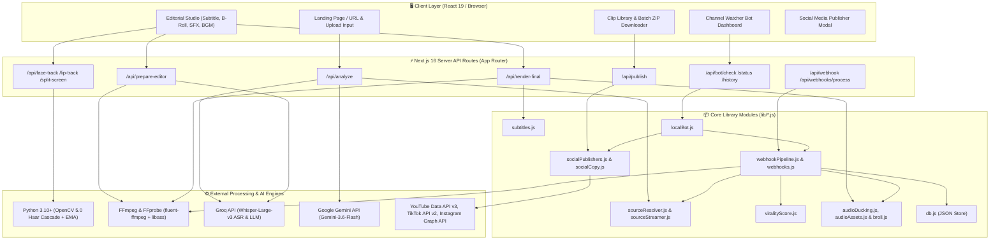
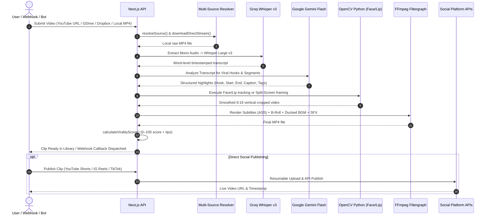

# 🏗️ Arlo Clipper — Architecture & Developer Documentation

> **Arlo Clipper** is an enterprise-grade AI-powered video clipping, transcription, vertical reframing, and social media automation system built with Next.js 16 (App Router), React 19, FFmpeg, OpenCV, Groq Whisper, and Google Gemini Flash.

---

## 📑 Table of Contents

1. [High-Level System Architecture](#1-high-level-system-architecture)
2. [Data Flow & Pipeline Lifecycle](#2-data-flow--pipeline-lifecycle)
3. [Directory & File Organization](#3-directory--file-organization)
4. [Core Modules In-Depth](#4-core-modules-in-depth)
   - [4.1 Multi-Source Resolver & Streamer](#41-multi-source-resolver--streamer)
   - [4.2 AI Speech & Virality Scoring Engine](#42-ai-speech--virality-scoring-engine)
   - [4.3 Subtitle Generator & ASS Styler](#43-subtitle-generator--ass-styler)
   - [4.4 Audio Ducking, SFX & B-Roll Engine](#44-audio-ducking-sfx--b-roll-engine)
   - [4.5 Social Publishing Engine](#45-social-publishing-engine)
   - [4.6 Webhook Automation Pipeline](#46-webhook-automation-pipeline)
   - [4.7 Local Channel Watcher Bot & Scheduler](#47-local-channel-watcher-bot--scheduler)
   - [4.8 Local Database & Persistence](#48-local-database--persistence)
5. [Computer Vision & Tracking Subprocesses](#5-computer-vision--tracking-subprocesses)
6. [Complete API Endpoints Reference](#6-complete-api-endpoints-reference)
7. [Environment Variables Reference](#7-environment-variables-reference)
8. [Data Models & Schema Specifications](#8-data-models--schema-specifications)
9. [Developer Extension & Contribution Guide](#9-developer-extension--contribution-guide)

---

## 1. High-Level System Architecture

Arlo Clipper is designed around a modular, non-blocking pipeline combining a Next.js server runtime, asynchronous Python computer-vision subprocesses, native FFmpeg stream composition, and cloud AI LLM/ASR APIs.



---

## 2. Data Flow & Pipeline Lifecycle

### End-to-End Clipping & Publishing Flow



---

## 3. Directory & File Organization

```text
arlo-clipper/
├── app/                              # Next.js 16 App Router UI & API Routes
│   ├── api/                          # Serverless & Node.js API Endpoints
│   │   ├── analyze/route.js          # AI Viral Highlight detection (Gemini / Groq)
│   │   ├── auth/route.js             # Admin authentication session handler
│   │   ├── bot/                      # Local Channel Watcher Bot API
│   │   │   ├── channels/preview/     # Channel video preview endpoint
│   │   │   ├── check/route.js        # Trigger manual/scheduled channel poll
│   │   │   ├── history/route.js      # Bot logs and processed video history
│   │   │   └── status/route.js       # Background scheduler liveness probe
│   │   ├── clips/                    # Saved clip CRUD & bulk operations
│   │   │   ├── [id]/route.js         # Single clip GET/DELETE
│   │   │   ├── bulk/route.js         # Bulk clip deletion
│   │   │   ├── bulk/download/        # Streaming ZIP bundle generator
│   │   │   └── route.js              # Clip list retrieval (pagination & filters)
│   │   ├── face-track/route.js       # OpenCV Haar Cascade single face tracker
│   │   ├── lip-track/route.js        # OpenCV active speaker lip tracker
│   │   ├── podcast-split/route.js    # OpenCV podcast dual split-screen processor
│   │   ├── prepare-editor/route.js   # Fast video slicer & Whisper transcription
│   │   ├── publish/                  # Social media publishing endpoints
│   │   │   ├── config/route.js       # OAuth tokens & credentials management
│   │   │   ├── status/route.js       # Clip publish status lookup & duplicate check
│   │   │   └── route.js              # Multi-platform direct publish dispatcher
│   │   ├── render/route.js           # Lightweight video preview renderer
│   │   ├── render-final/route.js     # Master FFmpeg composition burner
│   │   ├── split-screen/route.js     # Split-screen crop handler
│   │   ├── upload/route.js           # Local video file upload receiver
│   │   ├── webhook/route.js          # Inbound webhook pipeline trigger
│   │   └── webhooks/                 # Webhook administrative routes
│   │       ├── logs/route.js         # Activity log inspector
│   │       ├── process/route.js      # Async background pipeline processor
│   │       └── test/route.js         # Webhook test ping dispatcher
│   ├── bot/page.js                   # Automated Channel Watcher Bot dashboard
│   ├── components/                   # Shared UI Components
│   │   ├── AppLogo.js                # Dynamic SVG logo
│   │   ├── DirectPublishModal.js     # Social publishing dialog modal
│   │   ├── ThemeToggle.js            # Light/Dark mode switcher
│   │   └── WebhookModal.js           # Webhook payload & logs modal
│   ├── editorial/page.js             # Studio Workspace (ASS styling, B-Roll, Ducking)
│   ├── library/                      # Saved Clips Library & Video Player
│   ├── login/page.js                 # Authentication screen
│   ├── layout.js                     # Root Next.js layout
│   └── page.js                       # Primary input & video clipper generator
├── data/                             # Persistent JSON Databases (Zero External DB)
│   ├── botConfig.json                # Watcher bot preset & interval config
│   ├── botHistory.json               # Processed videos & execution history
│   ├── db.json                       # Saved clips database
│   ├── publishHistory.json           # Social media publication audit log
│   ├── socialTokens.json             # Encrypted OAuth tokens & credentials
│   └── webhooks.json                 # Inbound & outbound webhook activity logs
├── docs/                             # Architecture & developer specifications
│   ├── assets/                       # Visual demo GIF recordings
│   └── ARCHITECTURE.md               # This authoritative documentation
├── lib/                              # Core Domain Engine Libraries
│   ├── audioAssets.js                # Royalty-free SFX & BGM WAV synthesizer
│   ├── audioCatalog.js               # Client-safe BGM, SFX, & Ducking catalog
│   ├── audioDucking.js               # FFmpeg multi-stream complex filter builder
│   ├── broll.js                      # Native PNG/SVG visual cards generator
│   ├── brollCatalog.js               # B-Roll theme catalog & keyword matcher
│   ├── db.js                         # JSON database CRUD & pagination helper
│   ├── localBot.js                   # Channel watcher bot & background timer
│   ├── socialCopy.js                 # Viral copy, hooks, and hashtag generator
│   ├── socialPublishers.js           # Multi-platform direct publisher (YT/IG/TT)
│   ├── sourceResolver.js             # Multi-source input parser & normalizer
│   ├── sourceStreamer.js             # Direct HTTP stream downloader
│   ├── subtitles.js                  # ASS subtitle generator with Karaoke tags
│   ├── supabase.js                   # Optional Supabase client adapter
│   ├── viralityScore.js              # Virality scoring engine (Hook, Pace, Emotion)
│   ├── webhookPipeline.js            # Automated end-to-end video pipeline
│   └── webhooks.js                   # HMAC SHA-256 signer & webhook dispatcher
├── public/                           # Public static files & media assets
│   ├── assets/audio/                 # Synthesized BGM & SFX audio files
│   ├── assets/broll/                 # Synthesized B-Roll visual overlays
│   └── clips/                        # Rendered MP4 clips, ASS files & thumbnails
├── scripts/                          # Python Computer Vision & Automated Test Suites
│   ├── haarcascade_*.xml             # OpenCV Haar Cascade detection models
│   ├── record_live_demo.py           # Automated demo GIF generator
│   ├── test_*.mjs / test_*.py        # Automated unit and integration test scripts
│   ├── track_face.py                 # OpenCV Single Face Tracker with EMA
│   ├── track_lip.py                  # OpenCV Lip Motion & Active Speaker Tracker
│   └── track_split_screen.py         # OpenCV Dual-Speaker Podcast Split-Screen
├── package.json                      # Node.js project manifest ("type": "module")
├── requirements.txt                  # Python dependencies (opencv-python, numpy)
└── README.md                         # Project overview and quickstart guide
```

---

## 4. Core Modules In-Depth

### 4.1 Multi-Source Resolver & Streamer
- **Files**: [`lib/sourceResolver.js`](file:///d:/kerji/project/lib/sourceResolver.js), [`lib/sourceStreamer.js`](file:///d:/kerji/project/lib/sourceStreamer.js)
- **Role**: Normalizes diverse video input sources into a uniform descriptor and handles streaming downloads.
- **Supported Sources**:
  - **YouTube**: Standard `watch?v=`, shortlinks `youtu.be/`, Shorts `youtube.com/shorts/`, and Embeds.
  - **Google Drive**: Share links, preview links, folder links with automated virus warning confirmation bypass.
  - **Dropbox**: Preview/share URLs auto-converted to binary downloads (`dl=1`).
  - **TikTok**: Direct video and web URLs.
  - **Direct Video Streams**: Any HTTP(S) link ending in `.mp4`, `.mov`, `.webm`, `.mkv`, etc.
  - **Local Filesystem**: Uploaded files in `/uploads/` or absolute system paths.
- **Key Functions**:
  - `detectSourceType(input)`: Identifies source type.
  - `resolveSource(input)`: Returns a normalized `SourceDescriptor`.
  - `downloadDirectStream(url, outputPath)`: Streams binary data to disk with redirect following and byte integrity checks.

---

### 4.2 AI Speech & Virality Scoring Engine
- **File**: [`lib/viralityScore.js`](file:///d:/kerji/project/lib/viralityScore.js)
- **Role**: Analyzes transcript tokens, pacing, and lexical patterns to compute a 0–100 Virality Score.
- **Scoring Dimensions**:
  1. **Hook Strength (40% Weight)**: Evaluates the first 3 seconds for power words (Indonesian & English lexicons), curiosity gap questions, brevity (optimal: 4–12 words), direct address pronouns (`kamu`, `you`), and specific numbers (`3 Alasan`, `10x`).
  2. **Speech Pacing (30% Weight)**: Measures exact words-per-minute (WPM) targeting the optimal Shorts/Reels tempo zone of **135–170 WPM**. Imposes penalty deductions for awkward silent pauses exceeding 1.4 seconds.
  3. **Emotional Trigger (30% Weight)**: Classifies transcript sentiment across 5 dimensions: *Curiosity & Mystery*, *Shock & Urgency*, *Humor & Relatability*, *Inspiration & Growth*, and *Controversy & Debate*.
- **Outputs**:
  - `score` (0–100) & `grade` (`A+`, `A`, `B`, `C`).
  - Actionable Indonesian optimization recommendations (`tips`).
  - 3 AI Alternative Viral Opening Hooks (`alternativeHooks`).

---

### 4.3 Subtitle Generator & ASS Styler
- **File**: [`lib/subtitles.js`](file:///d:/kerji/project/lib/subtitles.js)
- **Role**: Converts Whisper segment and word-level timestamps into Advanced SubStation Alpha (`.ass`) subtitle files.
- **Features**:
  - **Dynamic Word Karaoke**: Uses `{\k<centiseconds>}` tags for smooth progressive word highlighting.
  - **Keyframe Visual Animations**:
    - `Pop`: Scale bounce `\fscx80\fscy80` -> `\fscx110\fscy110` -> `\fscx100\fscy100`.
    - `Slide Up`: Vertical rise animation.
    - `Blur`: Dissolves from `\blur6` to crisp text.
    - `Bounce`: Elastic multi-stage scaling.
  - **Resolution Scaling**: Calibrates font sizes and outline stroke relative to video canvas height (`PlayResY`).

---

### 4.4 Audio Ducking, SFX & B-Roll Engine
- **Files**: [`lib/audioDucking.js`](file:///d:/kerji/project/lib/audioDucking.js), [`lib/audioAssets.js`](file:///d:/kerji/project/lib/audioAssets.js), [`lib/broll.js`](file:///d:/kerji/project/lib/broll.js)
- **Role**: Assembles multi-layer video overlays and multi-stream audio graphs into a single FFmpeg `-filter_complex` pipeline.
- **Audio Ducking**:
  - Employs FFmpeg `sidechaincompress` to dynamically attenuate background music (BGM) whenever vocal audio is detected.
  - Three presets: `light` (35% drop), `medium` (65% drop), and `heavy` (85% drop).
- **SFX Engine**:
  - Automatically triggers punchy `impact` SFX at video hook start and `pop`/`ding` SFX on major segment transitions.
- **B-Roll Engine**:
  - Auto-detects transcript keywords to trigger thematic visual cards (*Finance, Technology, Success, Alert, Nature, Celebration*).
  - Generates zero-dependency binary PNG and SVG graphics on the fly.

---

### 4.5 Social Publishing Engine
- **Files**: [`lib/socialPublishers.js`](file:///d:/kerji/project/lib/socialPublishers.js), [`lib/socialCopy.js`](file:///d:/kerji/project/lib/socialCopy.js)
- **Role**: Coordinates direct API uploads to major social media platforms.
- **Platform Integrations**:
  - **YouTube Shorts**: YouTube Data API v3 resumable chunked upload protocol with scheduled publication and privacy controls.
  - **TikTok**: TikTok Content Posting API v2 with direct video posting, privacy flags, and duet/stitch restrictions.
  - **Instagram Reels**: Instagram Graph API two-step container creation, polling, and media publishing.
- **Auditing & Duplicate Detection**:
  - Prevents accidental duplicate uploads by checking video IDs and file signatures against `data/publishHistory.json`.
  - Generates platform-tailored copy packages with hooks, channel credits, and trending hashtags.

---

### 4.6 Webhook Automation Pipeline
- **Files**: [`lib/webhookPipeline.js`](file:///d:/kerji/project/lib/webhookPipeline.js), [`lib/webhooks.js`](file:///d:/kerji/project/lib/webhooks.js)
- **Role**: Headless automation pipeline triggered via HTTP POST.
- **Security & Reliability**:
  - Validates incoming requests and signs outbound callbacks using **HMAC SHA-256** (`x-arlo-signature`).
  - Automatic exponential backoff retries (3 attempts) on delivery failures.
  - Logs all payload activities to `data/webhooks.json`.

---

### 4.7 Local Channel Watcher Bot & Scheduler
- **File**: [`lib/localBot.js`](file:///d:/kerji/project/lib/localBot.js)
- **Role**: Background scheduler that polls YouTube channels for newly uploaded videos.
- **Mechanism**:
  - Fetches YouTube XML Atom RSS feeds (`/feeds/videos.xml?channel_id=...`) with fallback to `yt-dlp` flat playlist extraction.
  - Dispatches new unprocessed videos through the automated clipper pipeline.
  - Exports rendered MP4 clips, `.txt` human-readable copy files, and `.json` metadata into structured export directories.
  - Optional auto-publishing to configured social accounts immediately upon completion.
  - In-process timer persists across Next.js reloads via `globalThis.__arloBotInterval`.

---

### 4.8 Local Database & Persistence
- **Files**: [`lib/db.js`](file:///d:/kerji/project/lib/db.js), [`lib/supabase.js`](file:///d:/kerji/project/lib/supabase.js)
- **Role**: Zero-dependency local JSON database stored in `data/`.
- **Capabilities**:
  - Full CRUD operations with atomic filesystem writes.
  - Server-side pagination and real-time status mapping (Published vs Unpublished).
  - Seamless fallback client for optional Supabase cloud storage.

---

## 5. Computer Vision & Tracking Subprocesses

Arlo Clipper delegates computationally heavy computer-vision tasks to optimized Python subprocesses using OpenCV 5.0 and Haar Cascade models:

| Script | Purpose | Technique |
| :--- | :--- | :--- |
| `scripts/track_face.py` | Single Speaker 9:16 Auto-Crop | Haar Cascade face detection with Exponential Moving Average (EMA, $\alpha=0.08$) smoothing to eliminate camera jitter. |
| `scripts/track_lip.py` | Active Speaker Detection | Measures mouth ROI optical flow and vertical aspect variation to reframe camera to the speaker currently talking. |
| `scripts/track_split_screen.py` | Podcast Dual Split-Screen | Detects 2 dominant faces, frames each into a 9:8 view, and stacks them vertically into a 9:16 vertical layout with customizable divider. |

---

## 6. Complete API Endpoints Reference

### AI & Slicing Endpoints

| Method | Endpoint | Description | Payload / Params |
| :--- | :--- | :--- | :--- |
| `POST` | `/api/analyze` | AI video analysis & highlight extraction | `{ url: string, ratio: string }` |
| `POST` | `/api/prepare-editor` | Slices video segment & transcribes with Whisper | `{ url: string, startTime: string, endTime: string, ratio: string }` |
| `POST` | `/api/upload` | Uploads local video file to server | `multipart/form-data (file)` |

### Computer Vision Endpoints

| Method | Endpoint | Description | Payload / Params |
| :--- | :--- | :--- | :--- |
| `POST` | `/api/face-track` | Runs OpenCV single face tracking | `{ videoPath: string, ratio: string }` |
| `POST` | `/api/lip-track` | Runs OpenCV active speaker lip tracking | `{ videoPath: string, ratio: string }` |
| `POST` | `/api/podcast-split` | Runs OpenCV dual podcast split-screen | `{ videoPath: string }` |

### Rendering & Library Endpoints

| Method | Endpoint | Description | Payload / Params |
| :--- | :--- | :--- | :--- |
| `POST` | `/api/render-final` | Burns ASS subtitles, B-Roll, BGM, SFX into final MP4 | `{ videoPath, segments, style, audioSettings, brollSettings }` |
| `GET` | `/api/clips` | Retrieves paginated saved clips with status | `?page=1&limit=9&filter=all` |
| `GET` | `/api/clips/[id]` | Retrieves single clip details | URL parameter `id` |
| `DELETE`| `/api/clips/[id]` | Deletes clip from database and disk | URL parameter `id` |
| `POST` | `/api/clips/bulk` | Bulk deletes multiple clips | `{ ids: string[] }` |
| `POST` | `/api/clips/bulk/download` | Streams multiple clips as a `.zip` archive | `{ ids: string[] }` |

### Social Publishing Endpoints

| Method | Endpoint | Description | Payload / Params |
| :--- | :--- | :--- | :--- |
| `GET` | `/api/publish/config` | Retrieves sanitized social config | None |
| `POST` | `/api/publish/config` | Saves OAuth tokens and credentials | `{ youtube: {}, tiktok: {}, instagram: {} }` |
| `POST` | `/api/publish/status` | Checks clip publish status & duplicates | `{ clipId: string, videoPath: string, platforms: [] }` |
| `POST` | `/api/publish` | Dispatches direct publish to social networks | `{ clipId, platforms, privacy, customCaption }` |

### Webhooks & Bot Endpoints

| Method | Endpoint | Description | Payload / Params |
| :--- | :--- | :--- | :--- |
| `POST` | `/api/webhook` | Inbound webhook pipeline trigger | `{ url, ratio, faceTracking, subtitles, callbackUrl }` |
| `GET` | `/api/webhooks/logs` | Retrieves recent webhook event logs | `?limit=50` |
| `POST` | `/api/webhooks/test` | Dispatches a test ping webhook | `{ callbackUrl: string, secret: string }` |
| `GET` | `/api/bot/status` | Probes bot scheduler state & active config | None |
| `POST` | `/api/bot/status` | Updates bot settings and starts/stops scheduler | `{ enabled, checkIntervalMinutes, preset, ... }` |
| `POST` | `/api/bot/check` | Triggers immediate manual channel check | `{ isManual: true }` |
| `GET` | `/api/bot/history` | Retrieves processed video history & logs | None |
| `POST` | `/api/bot/channels/preview` | Previews recent videos from a channel | `{ channelUrl: string }` |

---

## 7. Environment Variables Reference

Create a `.env.local` file in the project root:

```env
# ==============================================================================
# AI API KEYS (Mandatory for AI features)
# ==============================================================================
# Groq API Key (Required for Whisper Large v3 speech transcription & fast LLM)
GROQ_API_KEY=gsk_your_groq_api_key_here

# Google Gemini API Key (Required for intelligent viral moment analysis)
GEMINI_API_KEY=your_gemini_api_key_here

# ==============================================================================
# SECURITY & AUTHENTICATION
# ==============================================================================
# Admin password for dashboard access
ADMIN_PASSWORD=your_secure_password_here

# Secret key for signing and verifying HMAC SHA-256 webhook payloads
WEBHOOK_SECRET=arlo_clipper_secret_key_here

# ==============================================================================
# SOCIAL MEDIA PUBLISHING CREDENTIALS (Optional - Configurable in UI)
# ==============================================================================
# YouTube Data API v3 OAuth Credentials
YOUTUBE_CLIENT_ID=your_youtube_client_id
YOUTUBE_CLIENT_SECRET=your_youtube_client_secret
YOUTUBE_REFRESH_TOKEN=your_youtube_refresh_token
YOUTUBE_ACCESS_TOKEN=your_youtube_access_token

# TikTok Content Posting API v2 Credentials
TIKTOK_CLIENT_KEY=your_tiktok_client_key
TIKTOK_CLIENT_SECRET=your_tiktok_client_secret
TIKTOK_ACCESS_TOKEN=your_tiktok_access_token
TIKTOK_REFRESH_TOKEN=your_tiktok_refresh_token

# Instagram Graph API Credentials
INSTAGRAM_ACCESS_TOKEN=your_instagram_user_or_page_access_token
INSTAGRAM_ACCOUNT_ID=your_instagram_business_account_id

# ==============================================================================
# OPTIONAL CLOUD STORAGE
# ==============================================================================
NEXT_PUBLIC_SUPABASE_URL=https://your-project.supabase.co
NEXT_PUBLIC_SUPABASE_ANON_KEY=your_supabase_anon_key
```

---

## 8. Data Models & Schema Specifications

All runtime data is persisted in JSON files in the `data/` directory:

### `data/db.json` (Clips Database)
```json
{
  "clips": [
    {
      "id": "c9a41852-d35e-436f-b1e0-c9a418520001",
      "title": "Rahasia Trading Crypto 10x Lipat",
      "videoPath": "/clips/c9a41852-final.mp4",
      "duration": 28.5,
      "hook": "Jangan pernah beli crypto sebelum tahu rahasia ini!",
      "caption": "Simak strategi trading praktis yang wajib kamu ketahui.",
      "channelName": "Crypto Daily",
      "startTime": "00:01:15",
      "endTime": "00:01:43",
      "hashtags": ["#Shorts", "#Crypto", "#Trading", "#Viral"],
      "viralityScore": {
        "score": 94,
        "grade": "A+",
        "badge": "High Viral Potential",
        "badgeEmoji": "🔥",
        "tips": [...]
      },
      "createdAt": "2026-09-24T08:30:00.000Z"
    }
  ]
}
```

### `data/botConfig.json` (Bot Configuration)
```json
{
  "enabled": true,
  "channelUrl": "https://www.youtube.com/@RadityaDika",
  "channelId": "UC_xyz123",
  "channelName": "Raditya Dika",
  "checkIntervalMinutes": 60,
  "maxVideosPerCheck": 1,
  "maxClipsPerVideo": 3,
  "lastCheckedAt": "2026-09-24T09:00:00.000Z",
  "nextCheckAt": "2026-09-24T10:00:00.000Z",
  "preset": {
    "ratio": "9:16",
    "faceTracking": true,
    "splitScreen": false,
    "subtitles": true,
    "subtitleAnimation": "Pop",
    "font": "Impact",
    "fontSize": "Medium",
    "color": "#FFFF00",
    "broll": "auto",
    "bgm": "upbeat-energetic",
    "ducking": "medium",
    "sfx": true
  },
  "exportSettings": {
    "autoExport": true,
    "exportDir": "exports",
    "generateTxtMetadata": true,
    "generateJsonMetadata": true
  },
  "autoPublish": {
    "enabled": false,
    "platforms": ["youtube"],
    "privacy": "public"
  }
}
```

---

## 9. Developer Extension & Contribution Guide

### Adding a New B-Roll Theme
1. Open [`lib/brollCatalog.js`](file:///d:/kerji/project/lib/brollCatalog.js) and append your new theme object to `BROLL_THEMES` with a unique `id`, `name`, `icon`, `color`, and keyword triggers.
2. In [`lib/broll.js`](file:///d:/kerji/project/lib/broll.js), add corresponding procedural drawing commands in `generateBrollPng()` and vector graphics in `generateBrollSvg()`.

### Adding a New Royalty-Free Sound Effect (SFX)
1. Open [`lib/audioCatalog.js`](file:///d:/kerji/project/lib/audioCatalog.js) and register your sound metadata in `SFX_SOUNDS`.
2. In [`lib/audioAssets.js`](file:///d:/kerji/project/lib/audioAssets.js), write a mathematical waveform synthesis function (e.g. `synthesizeLaser(sampleRate)`) and add it to the `generators` array in `ensureAudioAssets()`.

### Adding a New Social Media Publisher
1. Add platform credentials to `DEFAULT_CONFIG` in [`lib/socialPublishers.js`](file:///d:/kerji/project/lib/socialPublishers.js).
2. Implement your publisher function `publishToPlatform({ filePath, videoBuffer, caption, tags })`.
3. Hook the function into `publishToMultiplePlatforms()`.

---

*Authored for Arlo Clipper — AI Video Automation Engine.*
